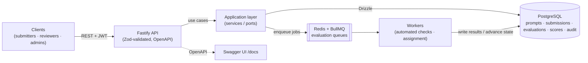

# AI Evaluation Gateway

A production-quality **Node.js + TypeScript** backend for human-and-automated evaluation of model
outputs — the kind of system that sits behind AI training and RLHF workflows. Submitters register
coding **prompts** and the **model outputs** that answer them; each output is routed through an
**evaluation pipeline** (async automated checks, then human reviewer scoring against a versioned
**rubric**); results, **model-output comparisons**, and an immutable **audit trail** are stored and
exposed through clean, documented REST APIs for analysis.

> **Project status:** Phase 0 — architecture. This repository currently contains the design
> ([`docs/`](docs/): ADRs + C4/domain/API/data/lifecycle views). Implementation begins in Phase 1.
> No application code is committed yet.

---

## Why this project exists

Modern AI training depends on *evaluation infrastructure*: pipelines that take model outputs, run
automated checks, route them to human reviewers, capture rubric-based scores and feedback, compare
candidate outputs, and keep an auditable history for analysis. This service is a focused, production-
shaped backend for exactly that problem — built to mirror real AI-engineering work rather than a
tutorial CRUD app.

It is designed to demonstrate the engineering an AI-training / Node.js backend role actually needs:

- **A real evaluation workflow** — prompt → model output → automated checks → reviewer scoring →
  finalization — modeled as an explicit state machine with history, not ad-hoc status flags.
- **Async job processing** — automated checks and assignment run on background workers
  (BullMQ/Redis) with retries, backoff, idempotency, and a dead-letter queue.
- **Reviewer workflow & governance** — rubric-based scoring, reviewer roles, model-output
  comparison/ranking, and an append-only audit log of who did what.
- **Production hygiene** — typed config, structured logging with correlation IDs, RFC 7807 errors,
  distributed rate limiting, authentication + RBAC, OpenAPI docs, containerization, and CI.

## What it demonstrates

| Area | How |
|------|-----|
| **Node.js + TypeScript** | Strict TS, ESM, clean layered architecture (domain / application / infrastructure / interface). |
| **HTTP framework** | **Fastify** — schema-first, fast, first-class TypeScript ([ADR 0001](docs/adr/0001-fastify-over-express.md)). |
| **PostgreSQL** | **Drizzle ORM** + drizzle-kit migrations; SQL-explicit data layer ([ADR 0002](docs/adr/0002-drizzle-orm.md)). |
| **Redis + queues** | **BullMQ** evaluation pipeline: workers, retries, DLQ, idempotency ([ADR 0003](docs/adr/0003-bullmq-evaluation-pipeline.md)). |
| **REST API design** | Resource-oriented, versioned, paginated; full contract in [api-design.md](docs/architecture/api-design.md). |
| **Authentication & roles** | JWT access/refresh + RBAC (`admin` / `reviewer` / `submitter`), argon2 hashing ([ADR 0005](docs/adr/0005-authentication-and-rbac.md)). |
| **Rate limiting** | Redis-backed, distributed, per-identity ([ADR 0007](docs/adr/0007-rate-limiting.md)). |
| **Validation & types** | **Zod** as the single source of truth → request validation **and** generated OpenAPI ([ADR 0006](docs/adr/0006-zod-validation-and-openapi.md)). |
| **Structured logging & errors** | **pino** JSON logs + correlation IDs; RFC 7807 problem responses ([ADR 0008](docs/adr/0008-logging-and-error-model.md)). |
| **Auditability** | Append-only audit log + immutable evaluation history ([ADR 0009](docs/adr/0009-audit-log-and-immutability.md)). |
| **Testing** | **Vitest** unit tests + Testcontainers integration (Postgres + Redis); `app.inject()` API tests. |
| **Docker & CI/CD** | Multi-stage Dockerfile, `docker compose` dev stack, **GitHub Actions** (lint, typecheck, test, build, image). |
| **API documentation** | OpenAPI 3 generated from Zod; Swagger UI at `/docs`. |

## Architecture at a glance



Full views — C4 context/container/component, the dependency rule, and quality attributes — are in
[`docs/architecture/overview.md`](docs/architecture/overview.md).

## Domain

Submitters, prompts, model outputs (submissions), evaluations, rubrics & criteria, reviewer scores,
comparisons, and audit logs — modeled in the language of AI evaluation. See the
[domain glossary](docs/architecture/domain-glossary.md), the
[evaluation lifecycle](docs/architecture/evaluation-lifecycle.md) (state machine + async pipeline),
and the [data model](docs/architecture/data-model.md).

## Technology

| Technology | Role |
|------------|------|
| **Node.js 20 + TypeScript (strict, ESM)** | Runtime and language |
| **Fastify** | HTTP framework |
| **PostgreSQL + Drizzle ORM (drizzle-kit)** | Persistence + migrations |
| **Redis + BullMQ** | Background workers / evaluation queues |
| **Zod** | Validation + OpenAPI generation |
| **pino** | Structured JSON logging |
| **argon2 + JWT** | Auth (hashing + tokens) |
| **Vitest + Testcontainers** | Unit + integration testing |
| **Docker / Docker Compose** | Containerization + local stack |
| **GitHub Actions** | CI/CD |
| **OpenAPI 3 + Swagger UI** | API documentation |

## Roadmap

- **Phase 0 — Architecture** *(current)*: ADRs, C4 + domain/API/data/lifecycle docs.
- **Phase 1 — Core API + persistence**: auth + RBAC, prompts, submissions, rubrics; Drizzle schema +
  migrations; Zod validation + OpenAPI; structured logging, error model, config; Vitest + integration tests.
- **Phase 2 — Evaluation pipeline**: BullMQ queues + workers (automated checks), evaluation state
  machine + history, idempotency, retries, DLQ.
- **Phase 3 — Reviewer workflow**: assignment, rubric-based scoring, model-output comparison/ranking,
  audit log.
- **Phase 4 — Analysis & hardening**: analytics endpoints (score aggregates, reviewer agreement,
  model leaderboard), rate limiting, metrics/health, Docker + GitHub Actions CI/CD.

## Local development *(target — lands in Phase 1)*

```bash
docker compose up -d          # PostgreSQL + Redis
pnpm install
pnpm db:migrate               # drizzle-kit migrations
pnpm dev                      # Fastify API (http://localhost:3000), Swagger UI at /docs
pnpm worker                   # BullMQ evaluation workers
pnpm test                     # Vitest unit + integration tests
```

## License

Released under the [MIT License](LICENSE).
