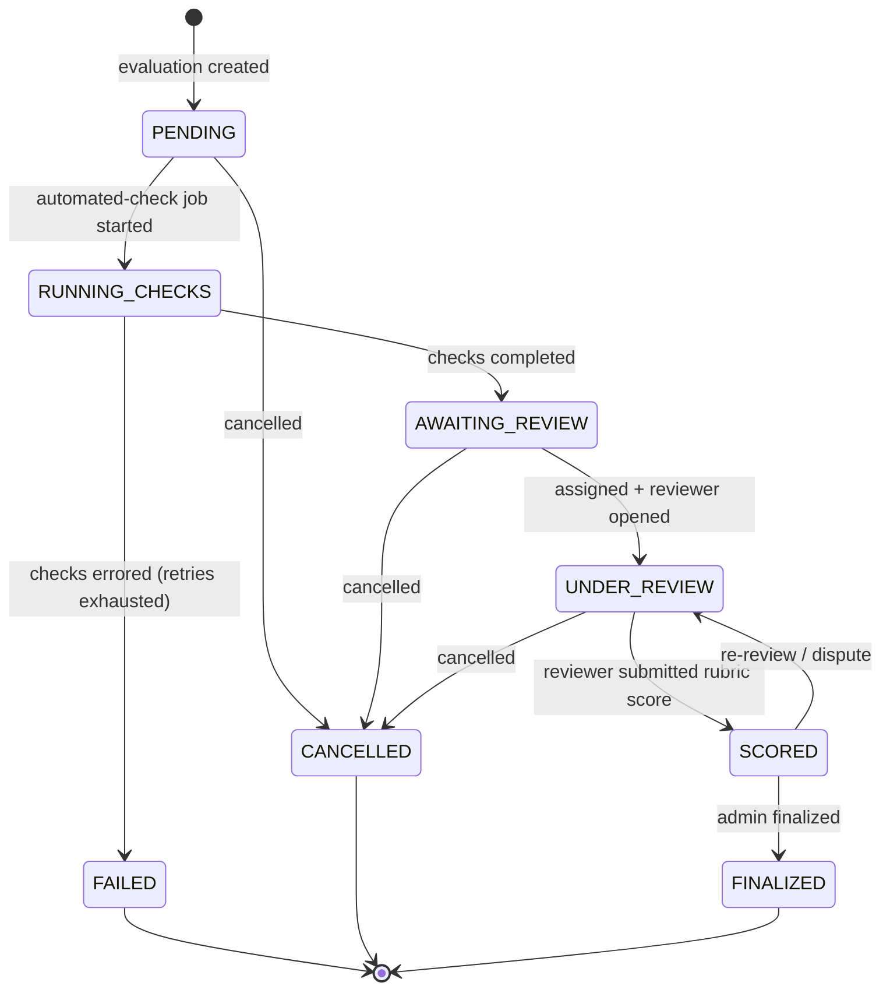

# Evaluation Lifecycle

How an `Evaluation` moves from a freshly submitted model output to a finalized, scored result — and how
the asynchronous pipeline drives it. The current status is a convenience column; the **append-only
`evaluation_events` stream is the authoritative history** ([ADR 0009](../adr/0009-audit-log-and-immutability.md)).

## State machine



**Invariants enforced by the domain (examples):**

- A score can only be submitted in `AWAITING_REVIEW`/`UNDER_REVIEW`, and only by the **assigned**
  reviewer (or an admin).
- A score must cover every rubric criterion, each value within that criterion's scale (else `422`).
- `FINALIZED`, `FAILED`, and `CANCELLED` are terminal; transitions out of them are rejected (`409`).
- Every transition appends an `evaluation_events` row with the actor (or `null` for system/worker).

These rules live in the **pure domain** state machine, so they are exhaustively unit-testable without a
database or queue ([ADR 0004](../adr/0004-layered-architecture.md)).

## Sequence — submit & run automated checks (async)

```mermaid
sequenceDiagram
    participant C as Client
    participant API as Fastify API
    participant DB as PostgreSQL
    participant Q as Redis / BullMQ
    participant W as Worker

    C->>API: POST /submissions/{id}/evaluations
    API->>DB: insert evaluation (PENDING) + event
    API->>Q: enqueue evaluation.automated {evaluationId}
    API-->>C: 202 Accepted {evaluationId, status: PENDING}

    Note over W,Q: asynchronously
    W->>Q: reserve job (idempotency key evaluationId:automated)
    W->>DB: transition PENDING -> RUNNING_CHECKS (+ event)
    W->>W: run static / structural checks (no untrusted execution)
    alt checks ok
        W->>DB: save automated_results; RUNNING_CHECKS -> AWAITING_REVIEW (+ event)
        W->>Q: enqueue evaluation.assignment {evaluationId}
    else transient error
        W->>Q: retry with backoff
    else retries exhausted
        W->>DB: RUNNING_CHECKS -> FAILED (+ event); raise EvaluationException
        W->>Q: move to evaluation.automated.dead (DLQ)
    end
```

The API never blocks on evaluation work; the worker owns progress, retries, and dead-lettering. A
redelivered job is recognized by its idempotency key and re-completes safely.

## Sequence — reviewer scoring

```mermaid
sequenceDiagram
    participant R as Reviewer
    participant API as Fastify API
    participant DB as PostgreSQL

    R->>API: GET /evaluations/{id}/rubric
    API-->>R: rubric version + criteria
    R->>API: POST /evaluations/{id}/scores {criteria[], comment}
    API->>API: authorize (assignee or admin); validate vs rubric scale
    API->>DB: insert reviewer_score (v1) + score_items
    API->>DB: transition UNDER_REVIEW -> SCORED (+ event)
    API->>DB: append audit_logs (EVALUATION_SCORED)
    API-->>R: 201 {scoreId, overallScore, version}
```

A correction posts a new score **version** (never an edit); the prior version and all history remain
([ADR 0009](../adr/0009-audit-log-and-immutability.md)).

## Async pipeline (queues)

| Queue | Trigger | Worker does | Failure handling |
|-------|---------|-------------|------------------|
| `evaluation.automated` | evaluation created | static/structural checks; persist results; advance state | retry+backoff → `…​.dead` DLQ → `FAILED` |
| `evaluation.assignment` | checks completed | assign to a reviewer / pool; advance to `AWAITING_REVIEW`/`UNDER_REVIEW` | retry; admin can reassign |
| `audit` (fan-out) | any auditable action | write audit entry asynchronously | retry; never blocks the request |

Every job carries the originating request's **correlation id**, so an evaluation's API log line and its
worker log lines share one id ([ADR 0008](../adr/0008-logging-and-error-model.md)).

## Reconstruction & analysis

- **Point-in-time:** fold `evaluation_events` for an evaluation up to a timestamp to see its exact state
  then.
- **Reviewer agreement / model leaderboard:** aggregate `reviewer_scores` + `comparisons` across
  submissions and models (the `/analytics/*` endpoints).
- **Comparisons** capture rankings / pairwise preferences — the data shape preference-based training
  consumes.
