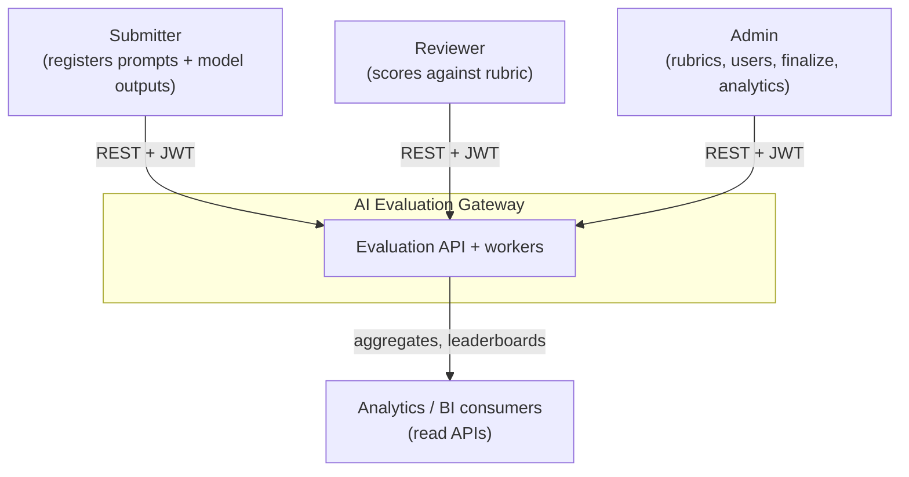
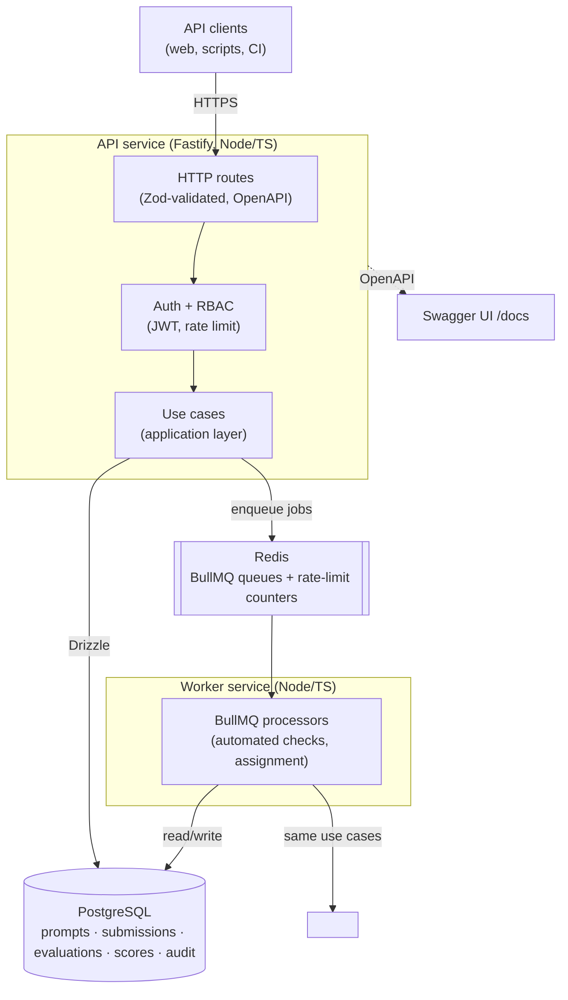
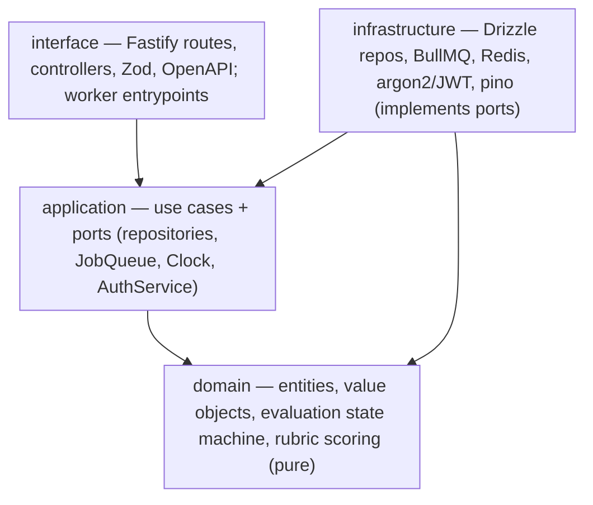

# Architecture Overview

The AI Evaluation Gateway is an API-first Node.js/TypeScript backend that turns model outputs into
scored, audited evaluations through an asynchronous pipeline. This document presents the system in
[C4](https://c4model.com/) levels (Context → Container → Component), the layered dependency rule, the
runtime paths, and the quality attributes the design optimizes for.

---

## Level 1 — System Context

**Boundary intent:** the gateway owns the evaluation lifecycle — prompts, model outputs, the
evaluation pipeline, reviewer scoring, comparisons, and the audit trail. It does not train models or
execute untrusted code in-process (see the sandbox note in [ADR 0003](../adr/0003-bullmq-evaluation-pipeline.md)).

---

## Level 2 — Container

- **API service** and **worker service** are separate deployables sharing the domain/application
  code; both invoke the same use cases ([ADR 0004](../adr/0004-layered-architecture.md)). They scale
  independently — APIs for request load, workers for evaluation throughput.
- **PostgreSQL** is the source of truth (including append-only history + audit, [ADR 0009](../adr/0009-audit-log-and-immutability.md)).
- **Redis** serves both the job queues ([ADR 0003](../adr/0003-bullmq-evaluation-pipeline.md)) and
  distributed rate-limit counters ([ADR 0007](../adr/0007-rate-limiting.md)).

---

## Level 3 — Layered architecture (the dependency rule)

Dependencies point **inward**: `domain` imports nothing external; `application` depends only on
`domain` + ports; `infrastructure` implements those ports; `interface` wires it together. The domain is
unit-testable with no database or broker.

---

## Runtime paths

**Submit & evaluate (write path):**
`POST model output → validate (Zod) → use case persists submission + creates Evaluation(PENDING) →
enqueue evaluation.automated job → 202 Accepted (evaluationId).`
A worker runs automated checks, persists results, advances the evaluation to `AWAITING_REVIEW`, and
enqueues assignment — all idempotent and retryable.

**Review (write path):**
`Reviewer GET assigned evaluation → POST rubric scores → validate against rubric version → use case
records an immutable reviewer_score + audit entry → evaluation advances to SCORED.`

**Analyze (read path):**
`GET analytics → read models over scores/evaluations (aggregates, reviewer agreement, model
leaderboard).`

See [evaluation-lifecycle.md](evaluation-lifecycle.md) for the full state machine and sequence diagrams.

---

## Quality attributes

| Attribute | How it is achieved |
|-----------|--------------------|
| **Testability** | Pure domain + ports; fast Vitest unit tier with no I/O; Testcontainers for integration. |
| **Reliability** | Async pipeline with retries, backoff, idempotency, and a DLQ ([ADR 0003](../adr/0003-bullmq-evaluation-pipeline.md)). |
| **Traceability** | Correlation ids across API + jobs; append-only history + audit log ([ADR 0009](../adr/0009-audit-log-and-immutability.md)). |
| **Security** | JWT + RBAC ([ADR 0005](../adr/0005-authentication-and-rbac.md)); argon2; rate limiting; no in-process execution of untrusted code. |
| **Correctness at the edge** | Zod validation + generated OpenAPI ([ADR 0006](../adr/0006-zod-validation-and-openapi.md)). |
| **Scalability** | Stateless API + separate workers; Redis-shared limits/queues; horizontal scale. |
| **Operability** | Structured JSON logs, health/readiness endpoints, typed config that fails fast. |
